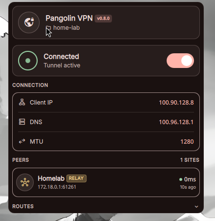
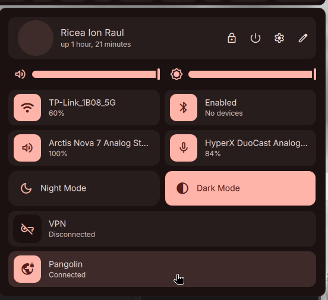
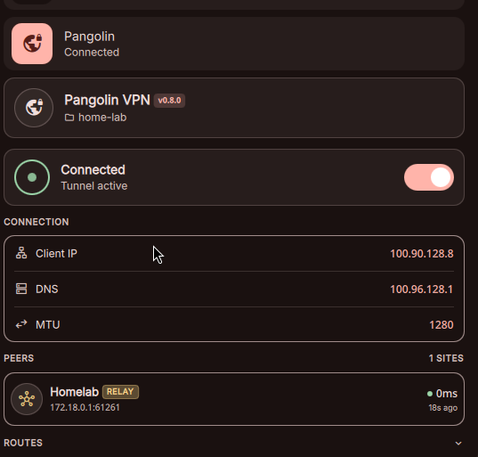
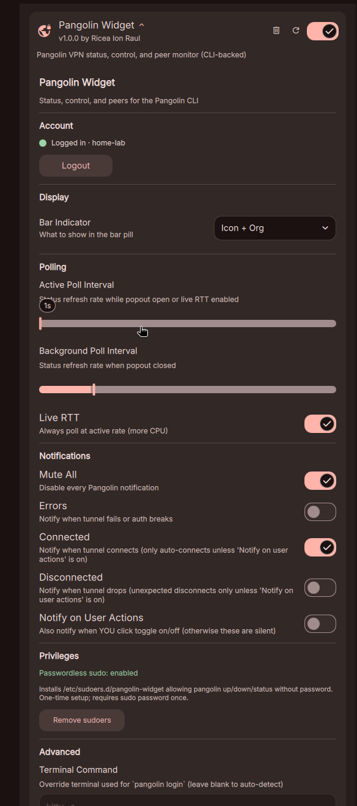

# Pangolin Widget

DankMaterialShell (Quickshell) plugin for [Pangolin](https://pangolin.net) VPN client.

Bar pill, control center quick tile, popout with peers/routes/connection details, polling with optional live RTT, notifications.

## Screenshots

### Bar pill


### Popout


### Control center tile


### Control center detail


### Settings


## Requirements

- DankMaterialShell + Quickshell
- `pangolin` CLI in `$PATH`
- `sudo` (for `pangolin up/down`); optional NOPASSWD via included sudoers helper

## Install

```sh
./sync.sh
```

Copies plugin into your DMS plugins dir.

### Optional: passwordless sudo

Avoids askpass prompt on connect/disconnect:

```sh
# from settings UI -> "Install sudoers"
# or manual:
sudo sh ./install-sudoers.sh
```

Uninstall:

```sh
sudo sh ./uninstall-sudoers.sh
```

## Settings

Stored in `~/.config/DankMaterialShell/plugin_settings.json` under this plugin id.

| Key | Default | Description |
|-----|---------|-------------|
| `barMode` | `icon_state` | Bar pill display mode |
| `popoutPollSec` | `3` | Poll rate while popout open or live RTT on |
| `backgroundPollSec` | `30` | Poll rate when popout closed |
| `liveRTT` | `false` | Always poll at active rate (more CPU) |
| `terminalCommand` | "" | Override terminal launch for `pangolin login` |
| `muteAll` | `false` | Disable all notifications |
| `notifyOnConnect` / `notifyOnDisconnect` / `notifyOnError` / `notifyOnUserActions` | mixed | Granular notification toggles |

## Files

- `Widget.qml` — plugin entry, bar/cc/popout wiring
- `Settings.qml` — settings panel
- `services/PangolinService.qml` — CLI wrapper, polling, state machine
- `services/PangolinNotifier.qml` — notification dispatch
- `components/` — UI parts (pills, tile, popout body, peer row, etc.)
- `askpass.sh`, `install-sudoers.sh`, `uninstall-sudoers.sh` — sudo helpers
- `sync.sh` — install script

## License

TBD
